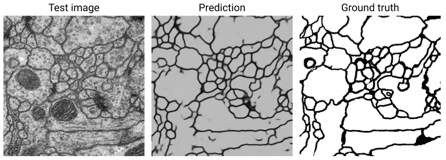

# UNet

UNet implementation for image segmentation in Julia build on top of the [Flux](http://fluxml.github.io/) library.

## Requirements

Please note that this package requires Flux v0.9.0. This stems from the "Up convolution" layers, which are ere coded through an `UpSample` layer that mutates arrays, which is not supported in later versions of Flux (>v0.10.0), due to the dependence on Zygote.

## Example performance

Using 20 training images in the ISBI 2012 cell segmentation challenge, trained on a Macbook Air for a few hours, without any image augmentation:



Better results can probably be achieved with more training and image augmentation.

## Example usage

### Inference

```julia
using UNet, Images, FileIO

# load image
img = load('data/my_img.png')
512×512 Array{Gray{N0f8},2}

# crop to allowed size (needs to satisfy n-4 % 16 == 0)
img = img[1:500, 1,:500]
500×500 Array{Gray{N0f8},2}

# tile the image (as we loose pixels from convs without padding)
img = unet_tiling(img)
692×692 Array{Gray{N0f8},2}

# finally, we can do inference
y_pred = unet(img2array(img))
500×500×1×1 Array{Float32,4}

# show the output
array2img(y_pred)
500×500 Array{Gray{N0f8},2}
```
### Training

A full walkthrough of model training can be found in `src/example_train.jl`

## Notes on architecture and tiling

Please note that this UNet uses the implementation described in the original paper [Ronneberger et al.](https://arxiv.org/abs/1505.04597).

In this implementation, the UNet uses convolutional layers without padding, which results in the output being smaller than the input. The output predicted segmentation will hence correspond to only the central area of the input. In order to obtain a segmentation prediction for the full input image, *tiling* has to be used.

In this package, the tiling can be done by passing the loaded image through the `unet_tiling` function. Please note that the input image needs to be of the right size in order for this to work, i.e. it needs to be square dimensions, `nxn`, where `n` has to satisfy `(n-4) % 16 == 0` (i.e. `n-4` needs to be divisible by 16).
